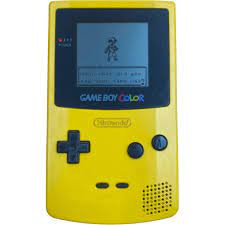
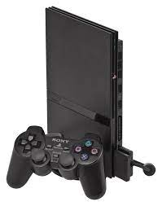
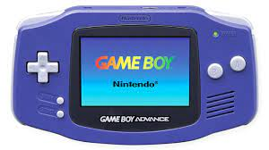
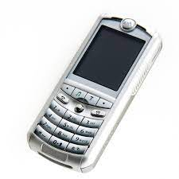
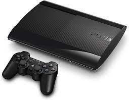
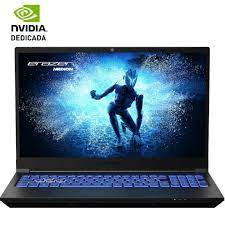
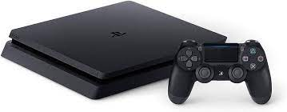
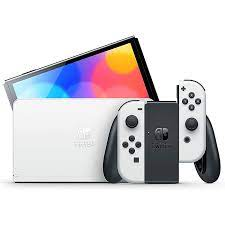

# **Línea de tiempo**

### Me llamo **José Alejandro Fondo** y ésta es mi **línea de tiempo**.

- En el año 1999 mis padres nos compraron nuestro primer ordenador, que fue un Windows 98, que su uso estaba destinado para que mi hermana trabajase para la Universidad de Deusto, pero yo lo usaba para jugar al Pinball y al Mario Bros, el cual lo teníamos instalado en un disquete.

   

- En el año 2001 tuve mi primera consola que fue la Play Station 1. Al poco tiempo la pirateamos para poder jugar a juegos descargados y quemados en un CD-ROM. Ese mismo año, para mi cumpleaños, me compraron la Game Boy Color de color amarillo con el juego de Pokémon amarillo.

     

- En el 2004, me compraron la Play Station 2 Slim con un Pro Evolution Soccer y otro juego de peleas. Le dí tanto uso que a los varios años el conector del transformador de la PS2 dejó de hacer contacto y me quedé sin ella. Además de la PS2, también me compraron la Game Boy Advance a la que también le dí mucho uso.

     

- Mi primer teléfondo móvil fue un Motorola con teclas cuando tenía 15 años. Me lo compraron porque ya empezaba a salir de fiesta con los amigos y era una forma de poder contactar conmigo y viceversa, pero al cabo de un año, se me perdió precisamente estando de fiesta en un pueblo cercano a donde vivía.

    

- Después, cuando tenía 16 años, cambiamos el PC a un Windows XP de sobremesa, ya que el Windows 98 ya se estaba quedando muy obsoleto tanto en capacidad como en velocidad.

    

- Con 17 años tuve mi primer móvil táctil de la marca Samsung. Además, ese mismo año, me compraron mi primer ordenador portátil de la marca HP. Era un ordenador con un procesador Intel Core I7 con 4 GB de RAM, y para su época era un buen portátil.

     

- Con 19 años me compraron la PS3 con un par de juegos y esos dos fueron los únicos a los que jugué. Con esa edad estaba más interesado en salir y estar con los amigos más que en quedarme en casa a jugar, pero aún así, sacaba algo de tiempo para dedicarselo a la PS3.

    

- Con 21 años, después de comenzar a trabajar, me compré un ordenador portátil gamming de la marca Medion con mis primeros sueldos. Disponía de 1TB HDD y 128 GB SSD, un microprocesador Intel I7 y 16 GB de RAM. La única pega es que al tener una pantalla de 17,1", era un portátil bastante grande en tamaño, pero el tamaño y calidad de la pantalla compensaban el que fuese de ese tamaño.

    

- Con 23 años decidí comprarme la PS4 porque iba a salir un juego al que quería jugar sí o sí. Ese mismo año cambié de teléfono móvil y me compré el Xiaomi Mi 8 Pro.

     

- Con 27 años cambié de móvil porque el Mi 8 con el que tan contento estaba dejó de cargar por fallo de contacto del cargador, asi que cambié a otro Xiaomi pero de una gama más baja, el Xiaomi Redmi Pro 11.

    

- Con 28 años, ya que seguía trabajando, me pude permitir comprarme la PS5 en el momento que había escasez de ellas. También decidí, junto con mi pareja, comprarnos a medias la Nintendo Switch Oled para que pudieramos jugar los dos a juesgos estilo Overcoocked.

     

- En la actualidad he comenzado a estudiar la carrera de **Ingeniería Informática** en la Universidad **Uneatlántico**, dejando atrás mi trabajo en el sector de la metalurgia para dar un cambio a mi futuro profesional. Por ello y ya que mi ordenador portátil era un poco antiguo y; además, voluminoso, he decidido comprarme un portátil PcCom Revolt de 13º generación, con 32 GB de RAM, 1 TB de disco SSD y una gráfica RTX 4060.

    