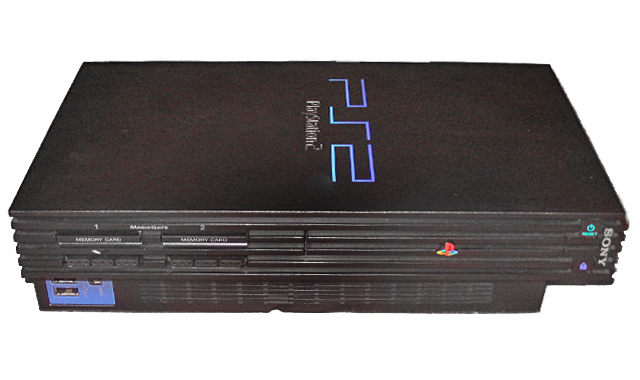
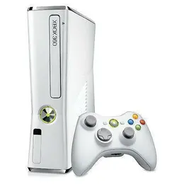

# Mi relación con la informática
## Primer contacto
### Playstation 2
Mi primer contacto con la informática fué cuando tenia unos 3 años, cuando mis padres me regalaron una **Playstation 2**, me gustaba mucho utilizarla, jugando durante horas diariamente.

### Xbox 360
Viendo lo mucho que me gustaba, decidieron regalarme la **Xbox 360**, en esa época, la últimma generación de consolas, junto con la Playstation 3, ya con más edad y entendiendo mejor lo que hacía, es cuando realmente empezó a engancharme el mundo de la informática, me parecía increible que desde el sofá de mi casa, pudiera estar jugando y hablando con un amigo que estuviera en la suya, además de jugar también con gente de incluso otros paises.

## Primer PC
Más adelante, me regalaron mi primer PC, uno que en la época era bastante potente, le utilizaba principalmente para jugar, aunque también investigaba lo que podía hacer con él, como ver videos, o realizar de manera más facil alguna tarea de clase.

## Estudios
Ya sabiendo lo mucho que me gustaba la informática y todo lo relacionado con ella, tras acabar el bachillerato, decidí hacer un **Ciclo Formativo de Grado Superior de Administración de Sistemas Informáticos en Red** (CFGS ASIR). Ahí aprendí todo lo que sé hasta ahora. Tras acabar el grado, decidí continuar estudiando la ingeniería informática, que es lo que estoy haciendo en la actualidad.