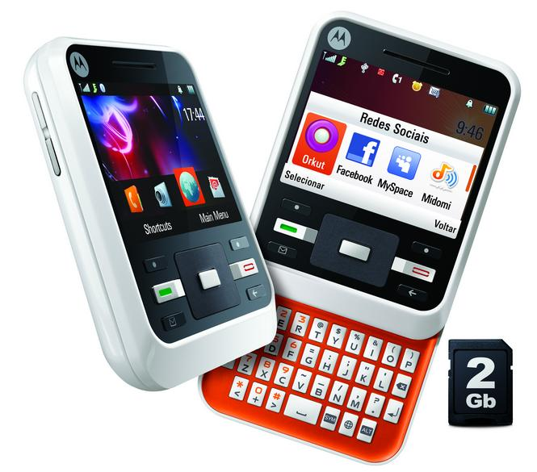
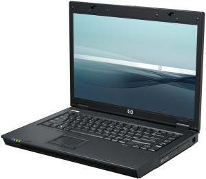

Timeline
=======
>  _Mi nombre es Angel Romero, nací en Honduras el 29 de junio del 2005 y esta es mi línea del tiempo sobre_  
> ### Mi interacción con la Informática:  
   
   
#### Mi primer celular  
* _Mi primer celular propio fue un Bmobile AX530._ Aunque mi primer contacto con un celular, sí mi memoria no me falla, fue con un Motorola A45; un dispositivo con  un teclado deslizable que fue lanzado al mercado en el año 2009.

| Bmobile AX530 | Motorola A45 |
|---|---|
|{width='12px'}|

A partir del [_Bmobile AX350_](https://www.pantallazo.es/caracteristicas/bmobile-ax530) empecé a tener nuevos celulares, como pueden ser:    
> * [Samsung S3 mini](https://www.xataka.com/moviles/samsung-galaxy-s-iii-mini)
> * [Samsung Galaxy S7](https://www.xataka.com/moviles/samsung-galaxy-s7-ranura-microsd-resistencia-al-agua-y-mejor-camara-para-reinar-en-la-gama-alta)
> * [LG q60](https://www.xatakamovil.com/lg/lg-q60-caracteristicas-precio-ficha-tecnica)
> * Y actualmente, [iPhone 13 Pro Max](https://www.xataka.com/analisis/apple-iphone-13-pro-max-analisis-caracteristicas-precio-especificaciones)

Y desde siempre me han gustado los juegos simples como lo es Minecraft, asi que cuando hablamos de computadoras, sus componentes no eran de gran exigencia.

**Mi Interacción con PC's**  
|| 
|:-:|
|Mi primer computadora fue una HP Compaq6710b, aunque siempre usaba las laptops que mi mamá utilizaba para su trabajo.|
*[Mas Info](https://www.notebookcheck.org/Analisis-HP-Compaq-6710b.5315.0.html)*   
---
    
 

