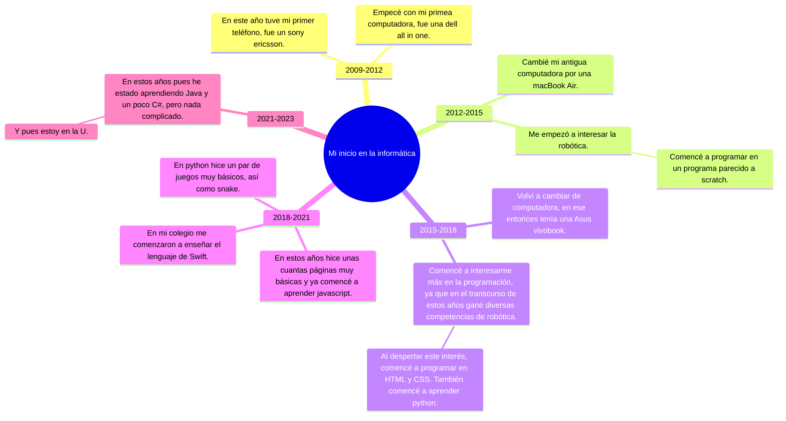

# Mi linea del tiempo

```mermaid
mindmap
  root((Mi inicio en la informática))
    2009-2012
         En este año tuve mi primer teléfono, fue un sony ericsson.
      
        Empecé con mi primea computadora, fue una dell all in one.
          
    2012-2015
      Cambié mi antigua computadora por una macBook Air.
       
      Me empezó a interesar la robótica.
       
        Comencé a programar en un programa parecido a scratch.
    2015-2018
      Volví a cambiar de computadora, en ese entonces tenía una Asus vivobook.
      
      Comencé a interesarme más en la programación, ya que en el transcurso de estos años gané diversas competencias de robótica.
        Al despertar este interés, comencé a programar en HTML y CSS. También comencé a aprender python.
        

    2018-2021
        En estos años hice unas cuantas páginas muy básicas y ya comencé a aprender javascript.
      
        En mi colegio me comenzaron a enseñar el lenguaje de Swift.
        
        En python hice un par de juegos muy básicos, así como snake.
       
    2021-2023
        En estos años pues he estado aprendiendo Java y un poco C#, pero nada complicado.
        
            Y pues estoy en la U.
```
