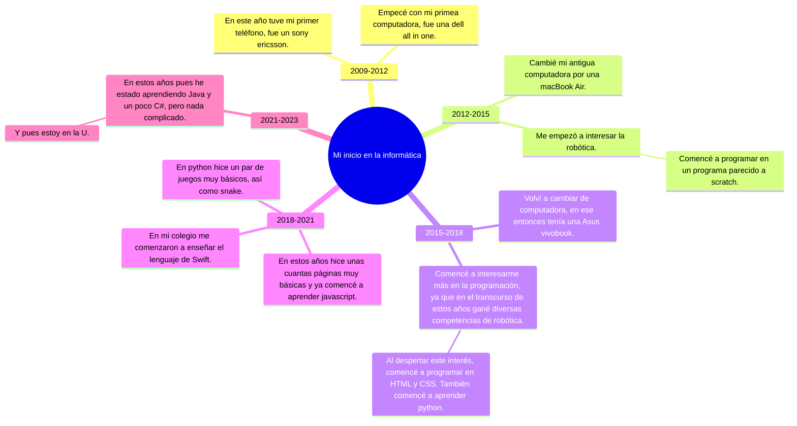

## Mi Línea de Tiempo en la Informática

- **2006**
  - Lanzamiento del PlayStation 3 (PS3) en el mercado.
  - Anhelé tener mi propia consola de videojuegos mientras seguía jugando en mi antigua PlayStation 2.

- **2009**
  - Adquirí mi primer teléfono móvil, un Sony Ericsson.
  - Empecé a explorar el mundo de los videojuegos en mi tiempo libre y me enamoré de la idea de crear los míos.

- **2012**
  - Finalmente, después de ahorrar durante años, compré un PlayStation 3 (PS3) y me sumergí en juegos como "The Last of Us" y "Uncharted".
  - También recibí mi primera computadora, una Dell All-in-One, como regalo de cumpleaños. Allí, mi interés por la informática comenzó a tomar forma.

- **2015**
  - Actualicé mi equipo informático a una MacBook Air, lo que facilitó mi trabajo y mis proyectos.
  - Mi interés por la robótica comenzó a crecer, y comencé a explorar la construcción de robots y la programación básica con Arduino.

- **2016**
  - Tomé un curso de programación en línea que me introdujo al mundo de la programación visual a través de Scratch y otros lenguajes sencillos.
  - Participé en mi primera competencia de robótica local y gané un premio por mi habilidad en la programación de robots autónomos.

- **2018**
  - Cambié mi computadora a una Asus Vivobook, lo que mejoró significativamente el rendimiento de mis actividades de programación y desarrollo web.
  - Gané el primer lugar en una competencia de robótica en mi colegio y me emocioné aún más por el potencial de la robótica y la programación.

- **2020**
  - Creé un proyecto de página web personal donde apliqué mis conocimientos en HTML, CSS y JavaScript para mostrar mis proyectos y logros.

- **2021**
  - Ingresé a la universidad y me sumergí aún más en el estudio de la informática.
  - Aprendí los conceptos básicos de Java y C# en mis primeros cursos.

- **2023**
  - He estado trabajando en proyectos más avanzados de programación en la universidad, aplicando mis habilidades en Java y C#.
  - Mi pasión por la informática sigue creciendo, y estoy emocionado por lo que depara el futuro en este campo, con la esperanza de contribuir al desarrollo tecnológico.

