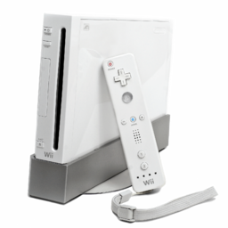
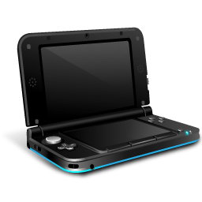
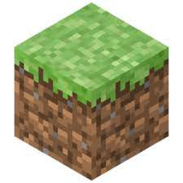

# Timeline
#### Mi relación con la informática

## Indice
* [Mi primer contacto con la informática](#mi-primer-contacto-con-la-informática)
* [Consolas](#consolas)
* [Mi primer videojuego](#mi-primer-videojuego)
* [Mi primer telefono](#mi-primer-telefono)
* [Mi primer ordenador](#mi-primer-telefono)
* [Mi segundo ordenador](#mi-segundo-ordenador)
* [Conclusión](#conclusión)


### Mi primer contacto con la informática
Mi primer contato con un aparato electrónico fué el ordenador de mi abuelo, un ordenador muy basico pero con el que estuve muchas horas

### Consolas

|Mis consolas|Imagen|
|---|:----------------------: |
|Tuve la ***wii*** varios años después de su lanzamiento.||
|Igualmente cuando tuve la ***ps2***, la ps3 ya estaba en el mercado y poco después saldría la ps4||
|La ***3ds*** fue mi última consola y la primera consola que tuve desde el lanzamiento.||

Las consolas han influido mucho en mi relación con la tecnología, gracias a los videojuegos es el porque me gusta la informática.


### Mi primer videojuego
Mi primer videojuego fue el [minecraft](https://www.minecraft.net/es-es), me le regalaron por mi cumpleños y probablemente fuese el mayor influyente para mi gusto por la informática. Gracias a su sistema de mecanismos en el juego aprendí sobre puertas lógicas como and o not y la infinidad de posibilidades que tenia cuando lo dominabas.



### Mi primer telefono
Y mi primer móvil fue un samsung pequeño que solo servía *para hacer llamadas y hablar por WhatsApp*.

### Mi primer ordenador
Cuando tenía 16 años había ahorrado suficiente dinero como para comprarme mi primer ordenador. Me compré los componentes por separado y lo monté yo mismo.
Para montarlo investigué bastante para saber que componentes eran mejores con el presupuesto que tenía y gracias a eso me empezó a interesar bastante el hardware.
Al final me decidí por un **ryzen de generación 2000** que era una generación antiguo pero era más económico.

En este mismo ordenador di mis primeros pasos en programación usando java aunque no profundicé demasiado. Además aprendí lo basico de HTML y CSS

>[!NOTE]
>
>Mi primer código como el de mucha gente fue un hola mundo en java
>```
>class HolaMundo{
>    public static void main(String [] args){
>        System.out.println("Hola mundo");
>    }
>}
>```
### Mi segundo ordenador
Por último este año me he comprado un portatil para que me sea más cómodo estudiar. Lleva un AMD **ryzen de generación 7000**

### Conclusión
Principalmente mi interés por la informática viene de trastear con el ordenador de mi abuelo como cuando necesitaba abrir los puertos del router para hacer un servidor con amigos para jugar minecraft. Ahí me di cuenta de que hay muchas cosas que puedes hacer con un ordenador y quise saber más sobre el tema.


