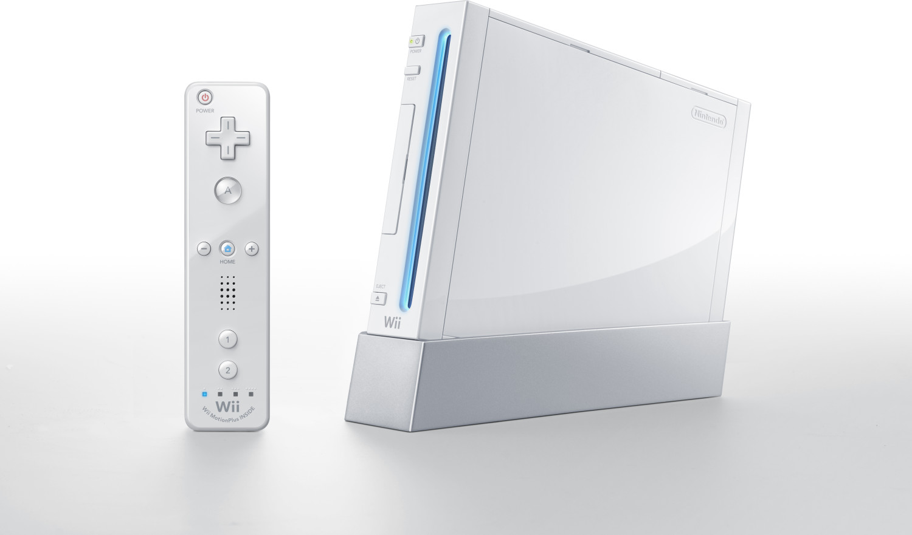
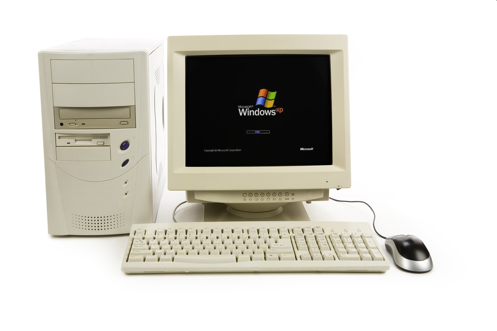

# Línea de tiempo 
### (Contacto con la informática.)
Esta es una línea de tiempo que tiene el propósito mostrar el porqué decidí estudiar informática, y tiene como base mostrar todas esas experiencias que me fueron marcando en el mundo de la tecnología e informática.

2009
---

- *En este año tuve mi primera consola, la mayoría de personas dirán que se acuerdan de jugar en la Play o en la Xbox, para mí, buena o mala suerte me toco jugar con la [Wii](https://nintendo.fandom.com/es/wiki/Wii#:~:text=Wii%20es%20la%20consola%20de,consola%20hogare%C3%B1a%20principal%20de%20Nintendo.), talvez hoy la vea como una consola obsoleta, pero en mis recuerdos, le tengo mucho cariño, ya que las partidas de Mario Kart a las 8 de la noche comiendo algún snack será algo que recordaré con mucha nostalgia.*

  

---

2012
---
- *Mi primer ordenador, recuerdo que tenía [Windows XP](https://www.profesionalreview.com/2020/12/20/historia-windows-xp/), y no era muy potente, pero aunque sea me alcanzaba para jugar FIFA 08, el Gta San Andreas y el Minecraft. Aquí fue donde empecé a interesarme un poco más con las computadoras, y su hardware, me gustaba mucho desarmarla y volverla a armar y le decía a mi mamá que era un técnico.*

  

---

2019
---
- *Tuve padres muy estrictos, es por eso que muchos años después fue que obtuve mi primer celular, era un [Huawei que ya no incorporaba los servicios de Google](https://www.pocket-lint.com/es-es/smartphones/noticias/huawei/148102-que-significa-la-prohibicion-de-google-de-huawei-para-su-telefono-huawei-u-honor/#:~:text=Estos%20tel%C3%A9fonos%20de%20Huawei%20no%20tienen%20servicios%20de%20Google&text=Eso%20significa%20que%20la%20serie,tienen%20ninguna%20aplicaci%C3%B3n%20de%20Google.), y tuve que personalmente volver a una versión más antigua de Android para poder instalar todas las aplicaciones y los servicios como tal, talvez para alguien en informática le parezca algo sencillo, pero el poder desarrollar una solución para un problema se sentía tan bien.*

  

---

2020
---
- *[La pandemia](https://www.paho.org/es/enfermedad-por-coronavirus-covid-19), algo que me dio mucho miedo, pero fue la oportunidad perfecta para descubrirme y saber un poco más de quién era y a que me quiero dedicar, durante este tiempo tome cursos de HTML, C++, Python, entre otros. Me gustaba mucho desarrollar programas para resolver un problema en concreto, ahí empezaba a interesarme un poco por la informática.*

  

---
2021
---
- *Estaba en “10mo grado” o como se conoce en otros países, primer año de bachiller, en este año en mi clase de computación aprendí muchas cosas, desde diseño 3D hasta el uso de programas como [C++ y Java](https://www.javatpoint.com/cpp-vs-java), era una clase que disfrutaba mucho, aunque hubo un momento dónde los ejercicios eran muy difíciles entonces empecé a perder el interés.*

  

---