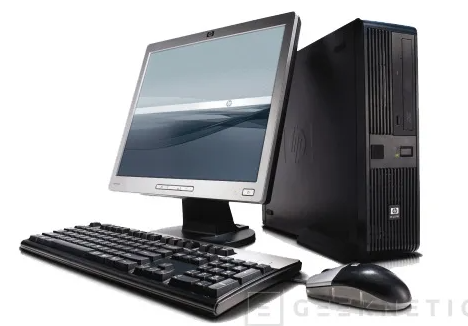
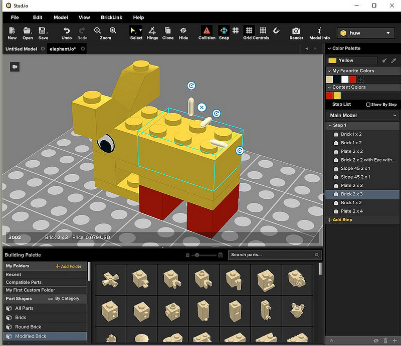
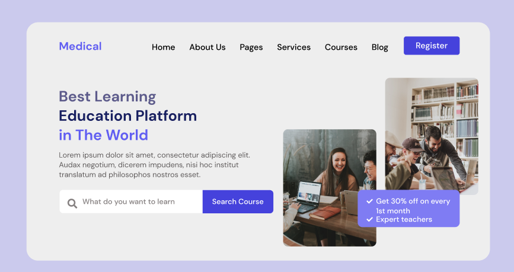
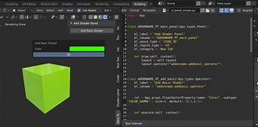
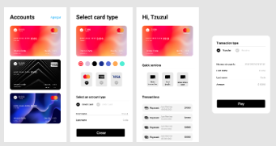
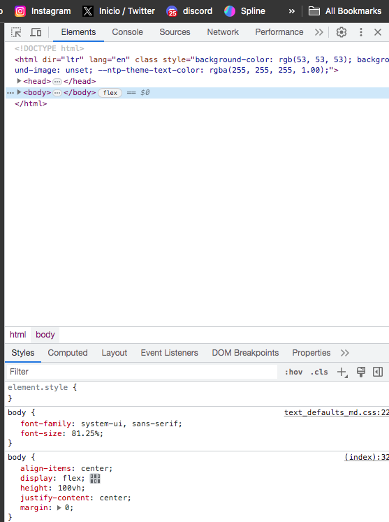

# Linea de tiempo

 

| **Año** |
**Evento**
 | **Imagen** |
|---|---|---|
|&darr;
**2007**|En primer grado, tuve mi primera interacción con un ordenador en la cual usábamos en clase de informática. Empezamos usando programas como *T-Box Planet* y *Scratch*.| |
|&darr;
**2010**|Nos presentaban un nuevo programa, donde se desarrollaban juegos interactivos usando comandos para desarrollar los personajes y renderizar paisajes.| |
|&darr;
**2015**| Introducción a la programación dirigida a la robótica y mi primer celular *Nokia*.| |
|&darr;
**2018**| Concurso de Resolución de Problemas Matemáticos usando Python: Primer Diseño de Sitio Web.| |
|&darr;
**2020**| Durante la pandemia, aprendí diseño de robots mediante el uso de bloques LEGO y programación de los mismos en Stud.io, así como animación 3D utilizando comandos de Python.| |
|&darr;
**2021**|Técnico en Figma, Python y C++. Ingreso a la universidad en la carrera de Business Analytics, donde aprendí Java, R y Python, enfocado en el análisis de datos.| |
|&darr;
**2022**|Adquisición de mi primera computadora de escritorio.||
|&darr;
**2023**|Ingreso a la Universidad UNETLANTICO, donde gracias a una beca colaborativa he aprendido HTML, CSS y SCSS.| |

