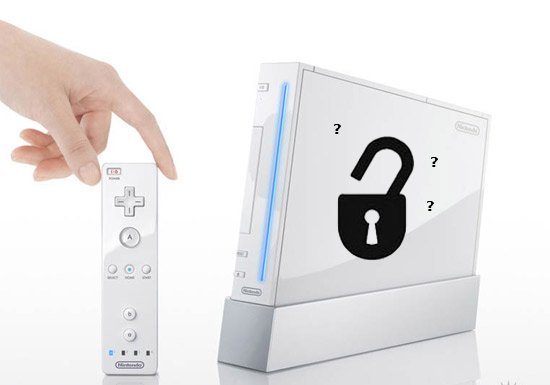
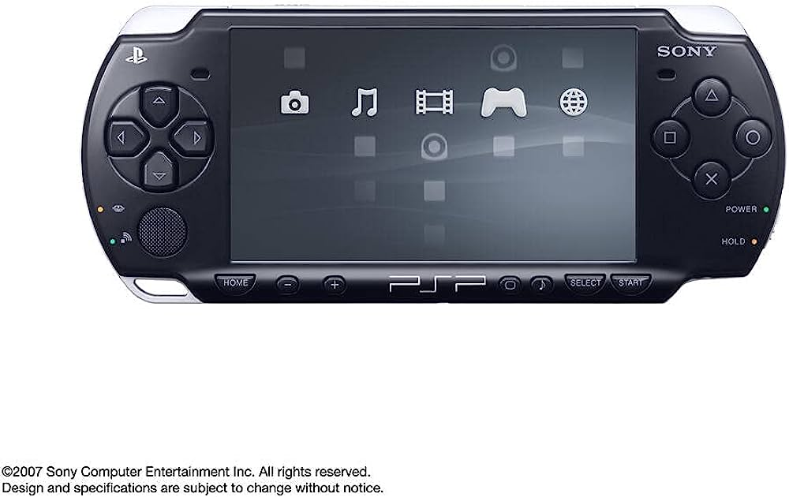
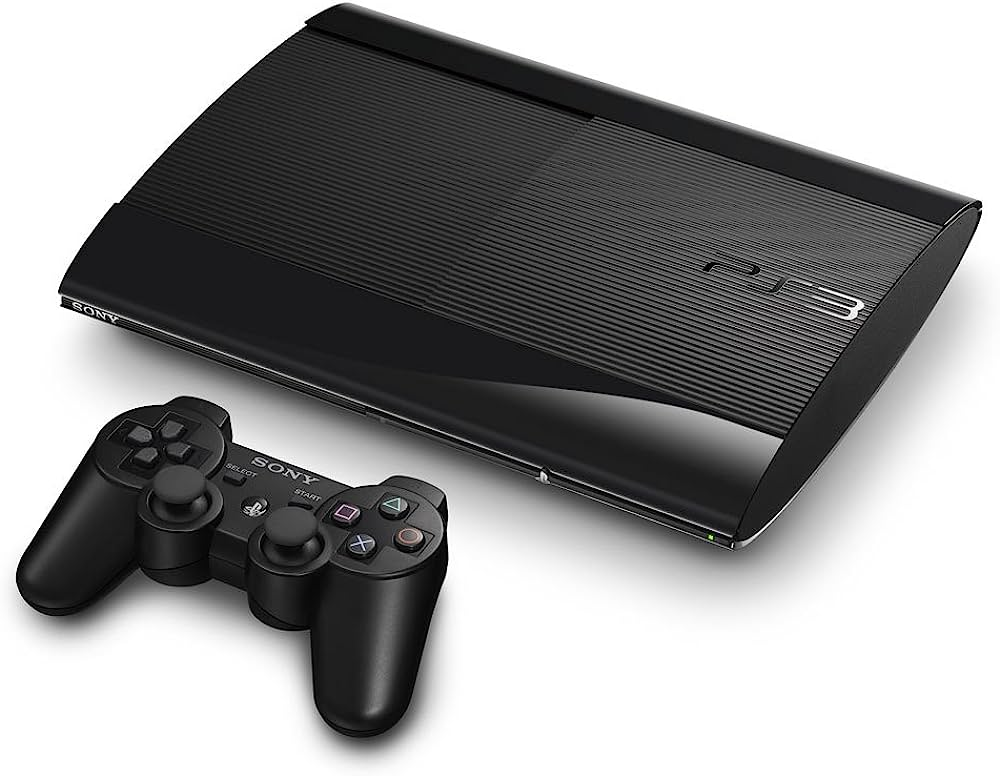

# Mi Línea de Tiempo en la Informática 💻
> "No temo a los ordenadores; lo que temo es quedarme sin ellos"
     -- Isaac Asimov
## 2008- 2011
- **2008** En este tiempo tuve un primer contacto con una computadora vieja y con una Nintendo Wii.
- **2011** Junto con la computadora y ayuda de amigos logramos "modificar" esta wii.

︶︶︶︶︶︶︶︶︶︶︶︶︶︶︶︶︶
## 2012-2013
- **2012** Durante este tiempo obtuve una PSP la cual gracias a la ayuda de tutoriales pude tambien "liberar".
 - **2013** En este año  tuve un PS3 con el que tuve un acercamiento mas cercano al mundo online y los servidores.
  
| PSP | PS3 |
| ------------- | ------------- |
| |  |

## 2014-2017
 - **2015** Obtuve un PS4 con el que pude disfrutar de un sistema online mucho mas trabajado y disfrutar de muchos juegos.

 - **2017** Empeze a interesarme mas en el tema de las computadoras y juego algunos juegos de poca exigencia en mi computadora.
  
  <video src="../SaveTube.io-PS4%20Startup.mp4" controls title="Title"></video>

  ## 2018-2021

  - **2018** Durante este tiempo logro armar una computadora mas potente y pueda jugar juegos mas potentes en la computadora.
   
  - **2019-2021** Me empeze a interesar aun mas por la informática y tuve algunos acercamientos con algunos lenguajes de programación
- [x] Aprender a armar una PC
- [x] Certificaciones de Word y Powerpoint
  

## 2022-2023
- **2022** Empiezo a adentrarme cada
  